# Student Management System


---

## 1. Nama Aplikasi

**Student Management System** (Sistem Manajemen Data Siswa)

---

## 2. Deskripsi Aplikasi

**Student Management System** adalah aplikasi web full-stack berbasis REST API yang digunakan untuk mengelola data siswa secara digital dan terstruktur. Aplikasi ini dibangun menggunakan arsitektur **MVC (Model-View-Controller)** dengan pemisahan yang jelas antara backend (Node.js + Express) dan frontend (HTML, CSS, JavaScript Vanilla).

### Fitur Utama:
- ✅ **CRUD Lengkap**: Create, Read, Update, dan Delete data siswa
- ✅ **Pencarian Real-time**: Cari siswa berdasarkan Nama atau NIS dengan fitur debounce
- ✅ **Filter Kelas**: Filter data siswa berdasarkan kelas tertentu
- ✅ **Pagination**: Pembagian halaman data untuk performa optimal
- ✅ **Upload Foto**: Mendukung upload foto profil siswa (format: JPG, PNG, WEBP, maks 2MB)
- ✅ **Validasi Data**: Validasi input di sisi client (frontend) dan server (backend)
- ✅ **Dark Mode**: Tampilan tema gelap/terang yang dapat di-toggle
- ✅ **Responsive UI**: Tampilan yang rapi dan mudah digunakan
- ✅ **Notifikasi Toast**: Feedback visual untuk setiap aksi pengguna

### Tujuan Proyek:
Proyek ini dibuat untuk memenuhi tugas mata kuliah **Praktik Pemrograman Web** sekaligus sebagai pembelajaran implementasi REST API menggunakan Node.js, Express, dan MySQL.

---

## 3. Teknologi yang Digunakan

### Backend:
| Teknologi | Fungsi |
| :--- | :--- |
| **Node.js** | Runtime environment untuk menjalankan JavaScript di server |
| **Express.js** | Web framework untuk membangun REST API |
| **MySQL** | Database relasional untuk menyimpan data siswa |
| **mysql2** | Driver Node.js untuk koneksi ke MySQL dengan support Promise |
| **Multer** | Middleware untuk menangani upload file (foto siswa) |
| **CORS** | Middleware untuk mengizinkan request cross-origin |
| **Nodemon** | Tool untuk auto-restart server saat ada perubahan kode |

### Frontend:
| Teknologi | Fungsi |
| :--- | :--- |
| **HTML5** | Struktur halaman web |
| **CSS3** | Styling dan tampilan UI |
| **Vanilla JavaScript** | Logika interaktif dan komunikasi dengan API |

### Tools & Environment:
| Tools | Fungsi |
| :--- | :--- |
| **VS Code** | Code editor |
| **Laragon** | Local server untuk MySQL |
| **HeidiSQL** | Database management tool |
| **Postman** | API testing |
| **Git & GitHub** | Version control |

---

## 4. Cara Menjalankan Backend

### Prasyarat:
Sebelum memulai, pastikan komputer Anda sudah terinstall:
- [Node.js](https://nodejs.org/) (versi 18 atau lebih baru)
- [Laragon](https://laragon.org/) atau [XAMPP](https://www.apachefriends.org/) (untuk MySQL)

### Langkah-langkah Instalasi:

#### Langkah 1: Clone Repository
```bash
git clone https://github.com/Emure06/student-management-system.git
cd student-management-system
npm install express
npm install nodemon 
npm install cors

#### Langkah 2: Siapkan Database
1. Buka **Laragon** atau **XAMPP**, lalu jalankan layanan **Apache** dan **MySQL**.
2. Buka alat manajemen database Anda (seperti **phpMyAdmin** atau **HeidiSQL**).
3. Buat database baru, misalnya dengan nama `student_management_system`.
4. Impor file `.sql` jika disediakan di dalam repository, atau pastikan struktur tabel sudah sesuai dengan model aplikasi.

#### Langkah 3: Konfigurasi Environment (Lingkungan)
1. Cari file bernama `.env.example` di folder utama (jika ada), lalu salin dan ubah namanya menjadi `.env`.
2. Buka file `.env` tersebut dan sesuaikan kredensial database Anda. Contoh konfigurasi dasar:
   ```env
   PORT=5000
   DB_HOST=localhost
   DB_USER=root
   DB_PASSWORD=
   DB_NAME=student_management_system
   ```

#### Langkah 4: Jalankan Aplikasi Backend
Untuk memulai server backend dalam mode pengembangan (*development mode*), jalankan perintah berikut di terminal:
```bash
npm run dev
```
*Catatan: Jika script `dev` belum dikonfigurasi di `package.json`, Anda juga bisa menjalankannya langsung dengan perintah:*
```bash
npx nodemon app.js
```
*(Ganti `app.js` dengan nama file utama backend Anda, seperti `server.js` atau `index.js`).*

Jika berhasil, Anda akan melihat pesan di terminal bahwa server telah berjalan (misalnya: `Server running on port 5000`).

## 5. Langkah Menjalalnkan front-end
 1. install live server di extansion 
 2. klik kanan pada file lalu klik open with live server
  dokumntasi 
  - 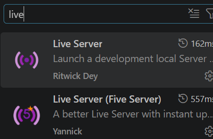 -install live server di extansion
  - 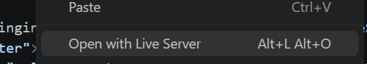 -klik with live server

## 6. Daftar End-Point
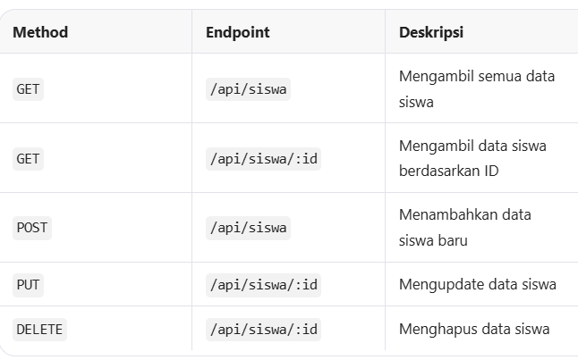 -bukti end point

## 7. 
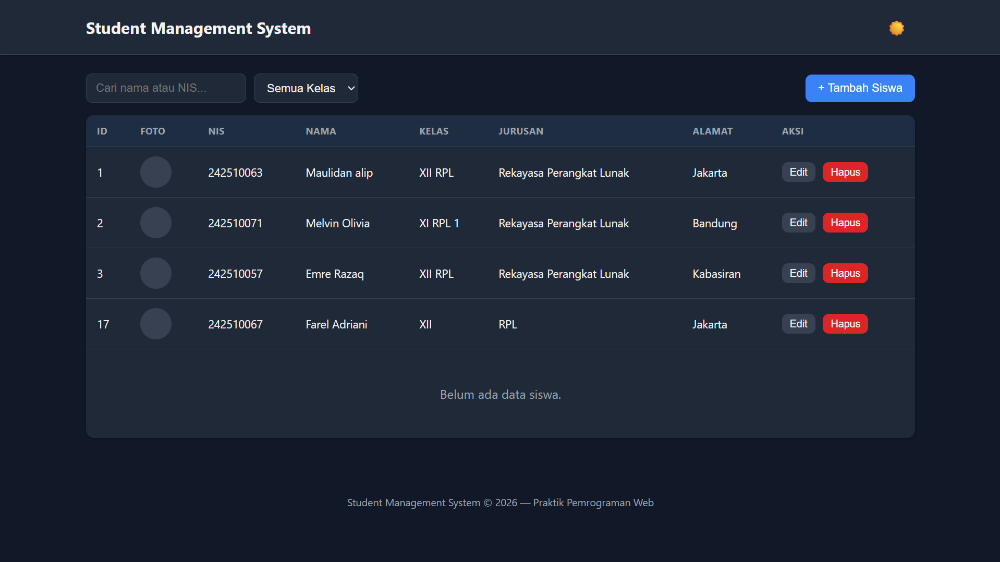 --scresot apk

## 8. Identitas Penulis
- Pembuat : Emre Razaq
- Kelas : 12 RPL
- TTGL : Bogor, 03-06-2009
- alamat : Kabasiran, Parung Panjang 
- Umur : 17 Tahun 

## Pengujian RestAPI
1. 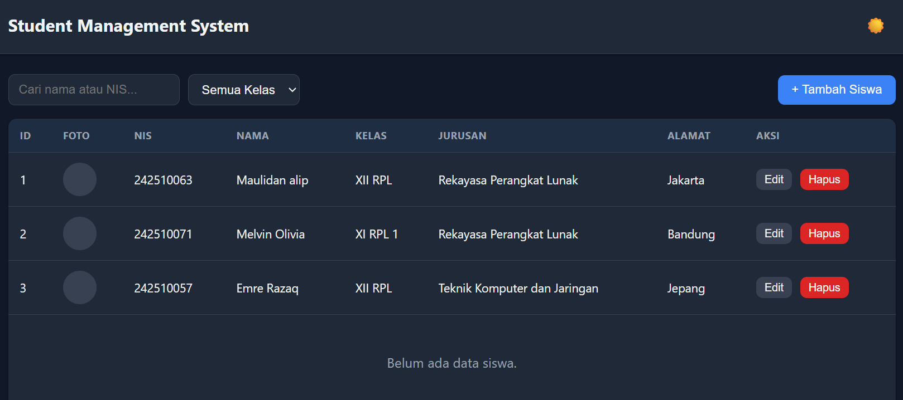
2. 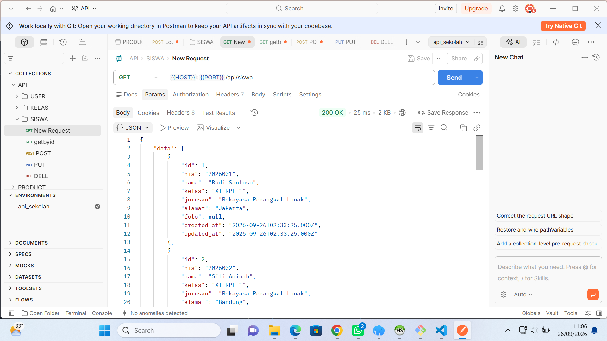 -getall
3. 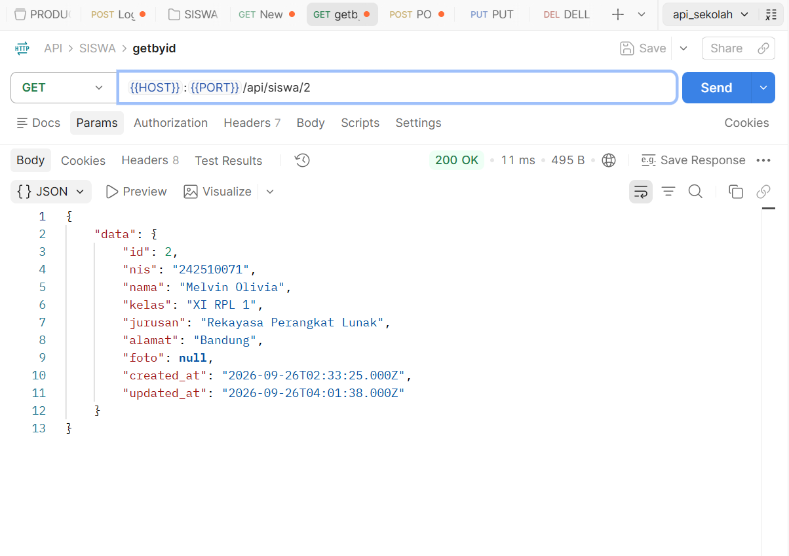 -getbyid
4. 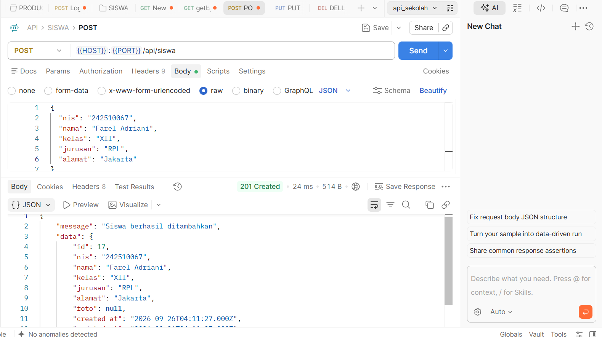 -post
5. 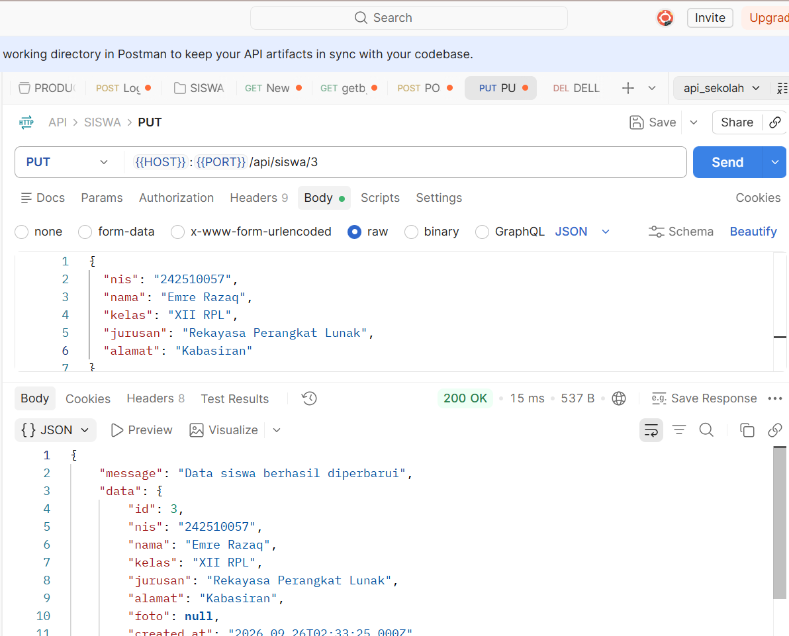 -dellete


## Contoh Code yang diperlukan
1. 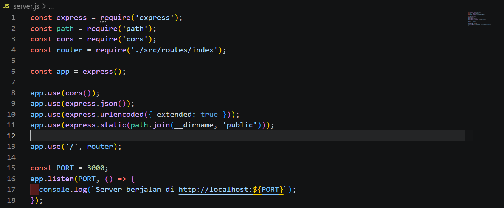 //server.js
2. 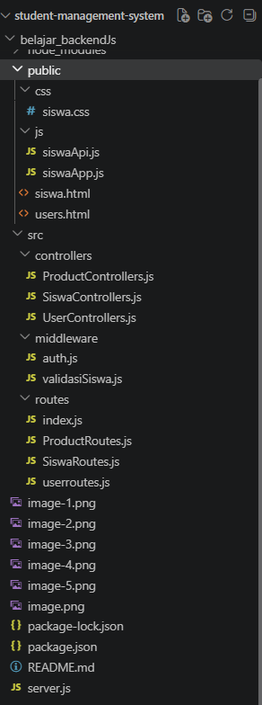
3. 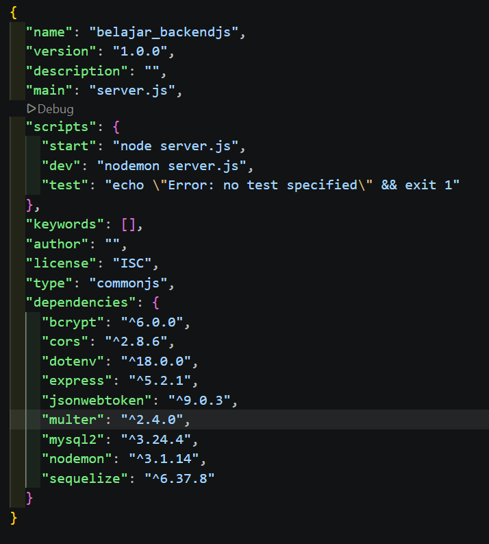 -- package.json (harus ada seperti -bycript dan lain lain)
4. // conection db ada di database.js 
5. routes ada di siswaRoutes.js
